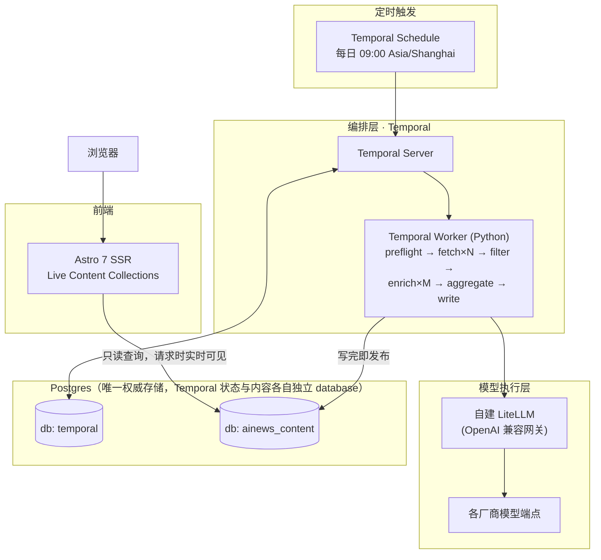

# AInews

[](./LICENSE)

一个把「AI 资讯每日自动汇总」从一次性 Claude Code 会话，重构成可持久化运行的后端服务 + 只读 SSR 前端的项目。

## 这是什么

AInews 每天定时抓取一批 AI 相关信息源（RSS、arXiv、Hugging Face Papers、a16z 等），过滤去重后交给 LLM 做富化（原文归档、翻译、摘要、结构化元数据），再按主题聚合成 Daily 简报、Topic 专题页和 Zettel 原子笔记，最终写入 Postgres，前端下一次请求即可见。

项目最初是一个 Claude Code skill（`/ai-news`），运行在一次交互式会话的生命周期里。这个模式有一个结构性问题：抓取 N 个信息源、归档 M 篇文章都是运行时才能确定数量的动态任务，一旦会话结束（无论是正常完成还是超时放弃），这些任务的执行状态就彻底丢失，没有任何机制能自动重试或补偿。真实发生过的案例是：某次运行 56 篇文章只处理完 16 篇就因为「超出会话合理等待范围」被放弃，只能靠事后人工核查补跑。

这个仓库是对应的重构：把「编排可靠性」从「一次会话的上下文」下沉为「一个独立服务的持久化状态」。

## 架构



流水线的核心设计原则：**Enrich 只判断「这篇文章本身是什么」**（原文归档/翻译/摘要），**跨文章的判断（该归哪个 topic、是否与同批次重复）只发生在 Aggregate 阶段**——这样 Enrich 才能安全地拆成每篇文章一条独立子线程并发跑，不需要互相等待。

## 技术栈

- **编排**：[Temporal](https://temporal.io/)（Python SDK）—— 持久化 workflow，接管动态 fan-out、重试、定时调度（Temporal 原生 Schedule）
- **存储**：PostgreSQL + JSONB，与 Temporal 共用同一实例、各自独立 database
- **模型调用**：`openai` SDK 换 `base_url` 直连自建 LiteLLM 网关，经 [Instructor](https://python.useinstructor.com/)（`Mode.JSON`）做结构化输出校验
- **前端**：[Astro 7](https://astro.build/)（`output: 'server'` + `@astrojs/node` adapter）+ 自建 Live Content Collections Loader 直连 Postgres，Tailwind CSS
- **测试**：pytest（后端，含用 Temporal 官方 time-skipping `WorkflowEnvironment` 驱动的真实 workflow 测试）

## 快速开始

需要本机已装 Docker。

```bash
git clone <this-repo>
cd ainews-project

cp .env.example infra/.env
# 编辑 infra/.env：至少填 POSTGRES_PASSWORD、LITELLM_BASE_URL、LITELLM_API_KEY
# LITELLM_BASE_URL 必须自带 OpenAI 兼容协议路径（形如 https://your-gateway/openai/v1）

cd infra
docker compose up -d
docker compose run --rm temporal-worker alembic upgrade head
```

- 前端：`http://localhost:4321`
- Temporal Web UI：`http://localhost:8088`（Schedules 页面可查看/暂停/手动触发每日调度）

## 目录结构

```
backend/    Temporal worker（Python）：抓取/过滤/富化/聚合/写入 activity，Alembic 迁移，pytest 测试
frontend/   Astro 7 SSR 前端，只读连 Postgres
infra/      通用版 docker-compose 编排
docs/       架构调研文档 + 各里程碑执行细化版（进度权威来源见下）
```

## 项目进展

各阶段的完成状态见 [`docs/milestones/README.md`](./docs/milestones/README.md)；业务规则的权威规格在 [`docs/04-roadmap.md`](./docs/04-roadmap.md)。

## License

[MIT](./LICENSE)
