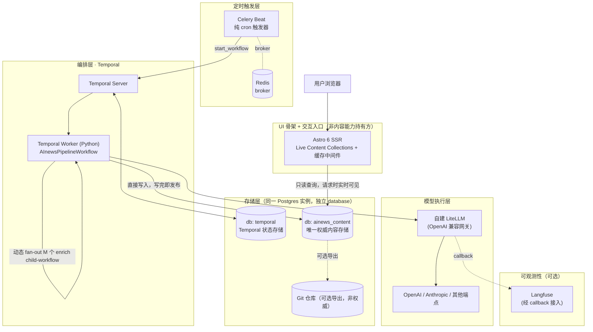

# AInews 服务化重构 — 可行方案总览

> 调研日期：2026-07-04。基于对现有 `/Volumes/Projects/AInews` skill+agent 管道的痛点分析，为迁移到"前后端分离 + 服务化部署"的新架构提供依据。本报告是本仓库的起点文档，后续实现请在新会话里以本报告为对齐基础展开。
>
> **同日修订**：初版把数据库定为 SQLite、把 Agent 执行层定为 Claude Agent SDK，讨论后发现两处都需要调整——用户已有自建 LiteLLM 做多模型统一转发，不希望被单一厂商 Agent 框架锁死；且 Temporal 生产环境本身强制要求 Postgres，"一步到位用 Postgres"比引入 SQLite 更省心。随后进一步修正：git 曾被沿用旧 vault 项目的惯性留在每次 pipeline 跑的关键路径上，但 Astro 切 SSR 直接查库之后 git 已不在任何运行时依赖链上——**Postgres 才是唯一权威存储**，git 降级为可选的、脱离主流程的导出能力。下表与架构图已更新为修订后结论，修订细节见 [01](./01-document-database-research.md) / [02](./02-pipeline-orchestration-research.md) / [03](./03-architecture-proposal.md) 顶部的修订说明。

## 1. 问题陈述

现有 AInews 管道是一个 Claude Code skill（`/ai-news`），在**单次交互式会话内**编排 8 个阶段、8 类 subagent。这套设计已经验证了内容模型（10-Daily / 20-Topics / 50-Zettel / 30-Digests / 60-Originals）和过滤/聚类规则的可行性，但把"编排可靠性"完全押注在一次会话的生命周期上，带来三个结构性问题：

**（1）动态 fan-out 没有持久化状态。** Phase 1 抓取要并发起 N 个 fetcher（N = 活跃信息源数，当前 14 个），Phase 3.5 原文归档要起 M 个 originalizer（M = 当天聚类条目数，规模随每日新闻量波动）。这两处的子任务数量都是**运行时才能确定**的，但"谁成功了、谁失败了、该重试谁"全部只存在于当次会话上下文里——会话一结束（无论正常完成还是因耗时/token 限制提前放弃），这些状态就彻底丢失，没有任何外部系统能接手补偿。

**（2）无自动重试/补偿机制，只能靠人工核查兜底。** 2026-07-04 当天真实案例（见 `99-Log/2026-07-04-run.md`）：56 条 entry 触发 Phase 3.5 需要起 56 个 originalizer，主会话在完成 16 个后以"超出自动化 pipeline 合理等待范围"为由，直接放弃了剩余 40 个（其中 22 条是 zettel-worthy 的重点条目），覆盖率仅 28%。这不是偶发 bug，而是"编排状态不持久化"在规模超出预期时的必然结果——事后靠人工核查、手动补跑才把覆盖率从 28% 提到 54/56。类似"补记""补漏"字样在近一周的 commit 历史里反复出现，是同一根因的不同表现。

**（3）无法真正脱离 Claude Code 会话运行。** 现有 `SKILL.md` 明确记录了已评估并放弃的三条路：Cloud Routines 拿不到本地 vault、`/loop` 7 天会自动过期、launchd/cron 不支持 slash command 调用——最终只能靠 Desktop Scheduled Task + "始终保持电脑唤醒"这种强依赖单机长期在线的方案硬撑。这正是本次重构要摆脱的模式。

## 2. 目标

把"编排可靠性"从"一次会话的上下文"下沉为"一个独立服务的持久化状态"，同时保留三样已经验证过、不需要重新发明的资产：

- 现有内容模型（Daily / Topic / Zettel / Digest / Original 五类文档 + wikilink 图谱）
- 现有前端视觉设计（Astro 组件 / 布局 / Tailwind 样式）
- 现有 8 个 subagent 的 prompt 工程成果（`.claude/agents/news-*.md`，已经过多轮调优）

系统边界上有一条贯穿全部结论的原则：**"后端"指提供内容能力（抓取/富化/聚合/查询）的 Temporal + Celery + 查询接口三者合集，Astro 只是 UI 骨架 + 交互入口**。内容更新就是后端对 Postgres 的一次写入，前端下一次请求立即可见——不需要重新构建、不需要重新部署、不需要重启任何容器。这是长期运行服务与"每次都要重新发布静态站点"模式的根本区别，也是本次重构要达成的最终形态。

## 3. 结论摘要

| 决策点 | 结论 | 详见 |
|---|---|---|
| 文档数据库 | **PostgreSQL + JSONB**，与 Temporal 共用同一 Postgres 实例（独立 database）；理由是 Temporal 生产环境本身强制要求 Postgres/MySQL，加上"长期运转"的前提，一步到位更省心；MongoDB 可跳过 | [01-document-database-research.md](./01-document-database-research.md) |
| 流水线编排 | **Temporal** 作持久化编排骨架，接管动态 fan-out / 重试 / 补偿；**Celery 降级为纯 cron 触发器**；每个 activity 内部**直连自建 LiteLLM**（可选 Instructor 做结构化输出校验），不引入任何厂商专属 Agent 框架 | [02-pipeline-orchestration-research.md](./02-pipeline-orchestration-research.md) |
| 前端渲染 | 继续用 **Astro**（建议升级到 6），切 `output: 'server'` + Node adapter + Live Content Collections，请求时查 Postgres，组件/布局基本零改动 | [03-architecture-proposal.md §4](./03-architecture-proposal.md) |
| 内容权威 | **PostgreSQL 是唯一权威存储**，`write_activity` 直接写入 `documents` 表即完成发布；git 不再处于任何请求/运行时依赖链上，降级为可选的、脱离主流程的导出能力（供 Obsidian 浏览/审阅历史）；Postgres 自身的备份（`pg_dump`/PITR）因此成为硬需求 | [01](./01-document-database-research.md) / [03](./03-architecture-proposal.md) |
| 可观测性（可选） | **Langfuse** 经 LiteLLM callback 零代码接入，补 Temporal Web UI 覆盖不到的"模型调用内容/成本"这一层；自托管较重（4 组件），建议分阶段引入 | [03-architecture-proposal.md §7](./03-architecture-proposal.md) |
| 流水线颗粒度 | 脱离 Claude Code 会话固定开销后，颗粒度可以下沉到**每篇文章一条独立子线程**（`enrich_activity` fan-out）：抓原文+翻译判断+抽取富元数据，只判断"文章本身"；topic 聚合等跨文章判断独立成 `aggregate_activity`；原 `00-Inbox/*.json` 手工 IPC 文件整体废弃，`articles` 表即 durable 中间态 | [03-architecture-proposal.md §4](./03-architecture-proposal.md) |

## 4. 总体架构（概览图）

## 5. 报告导航

- [`01-document-database-research.md`](./01-document-database-research.md) — 文档数据库选型完整调研
- [`02-pipeline-orchestration-research.md`](./02-pipeline-orchestration-research.md) — 编排框架选型完整调研
- [`03-architecture-proposal.md`](./03-architecture-proposal.md) — 整体架构、数据模型草案、Phase 映射、部署拓扑、迁移路径、待决问题
- [`04-roadmap.md`](./04-roadmap.md) — **新会话的推进入口**：不耦合旧 AInews 目录的功能清单（业务规则完整提炼）+ 里程碑设计，直接照此推进开发，无需回读旧仓库
