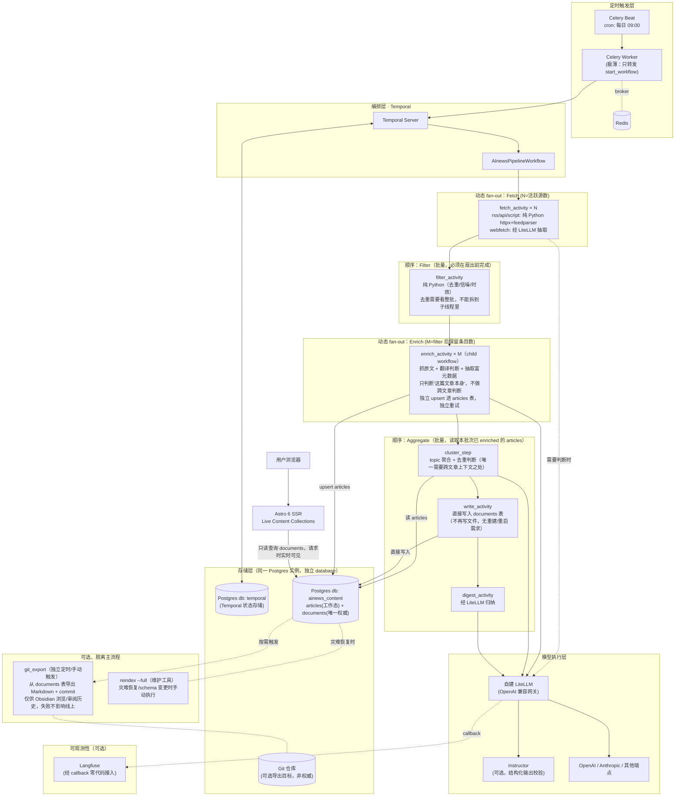

# 整体架构方案

> 综合 [01-document-database-research.md](./01-document-database-research.md) 与 [02-pipeline-orchestration-research.md](./02-pipeline-orchestration-research.md) 的结论，给出可落地的组件划分、数据模型草案、Phase 映射、部署拓扑与迁移路径。本文档的设计尚未实现，落地前请先按 [§7 待决问题](#7-待决问题) 与用户对齐。

> **2026-07-04 修订（一）**：三处联动变化——(1) 数据库从 SQLite 改为 PostgreSQL + JSONB（与 Temporal 共用实例）；(2) Agent 执行层从 Claude Agent SDK 改为直连自建 LiteLLM + 可选 Instructor；(3) 新增可观测性组件 Langfuse（经 LiteLLM callback 接入，零代码改动）。改动原因详见 [01](./01-document-database-research.md) 与 [02](./02-pipeline-orchestration-research.md) 的修订说明。
>
> **2026-07-04 修订（二）·流水线颗粒度重设计**：现有 Claude Code subagent 架构里"cluster 要批量判断全部条目""originalize 才按条 fan-out"这种粗颗粒度，根源是每次 spawn subagent 都要背一整套 Claude Code 系统上下文，固定成本高到必须靠批量摊薄。服务化之后直连 LiteLLM，每次调用只背精简 system prompt，边际成本主要是内容本身，颗粒度可以下沉到"每篇文章一条独立子线程"。本次修订把原 Phase 3 Cluster 的判断部分与 Phase 3.5 Originalize **合并成一个 per-article 的 `enrich_activity` fan-out**，topic 聚合等跨文章判断挪到独立的 `aggregate_activity` 里，并废弃 `00-Inbox/*.json` 手工 IPC 文件（`articles` 表本身就是durable 中间态）。同时确认了一条设计边界：**per-article 线程只能判断"这篇文章本身是什么"，不能判断"该归哪个 topic/是否与同批次其他文章重复"这类跨文章关系**——后者必须留给聚合阶段。向量化/embedding 作为已确认的未来扩展方向，见 [§8](#8-未来扩展向量化--自建-rag)。
>
> **2026-07-04 修订（三）·git 退出关键路径 + 后端边界重新划定**：原设计把 `write_activity`（写 Markdown 到 git 目录）+ `git_sync_activity`（commit+push）留在每次 pipeline 跑的关键路径上，这是照搬旧 AInews vault 项目"git 是运行时依赖"的惯性——但 Astro 切到 SSR 直接查 Postgres 之后，**git 完全不在任何请求路径或运行时依赖链上**，把它留在关键路径里只是历史包袱，没有运行时收益。本次修订：(1) **Postgres 变成唯一权威存储**，`write_activity` 直接把内容写进 `documents` 表，不再经过"写文件→git commit→reindex 扫描文件"这三步，`reindex_activity` 从"每次跑都要执行的关键步骤"降级为"schema 变更或灾难恢复时才用的独立维护工具"；(2) git 导出（如果要保留，用于 Obsidian 浏览/审阅历史）变成一个**完全脱离主 pipeline 的可选任务**，导出失败不影响线上服务；(3) 明确"后端"的边界——真正提供"内容能力"（抓取+查询）的是 **Temporal（编排）+ Celery（触发器）+ 查询接口（Astro SSR 的 Node 进程负责，或未来拆成独立 API）** 这三者的合集，Astro 只是承载它们输出的 UI 骨架 + 交互入口，不是独立于"后端"之外的另一套系统。这也是"内容更新即数据库写入、无需重建/重新部署/重启容器"这个长期运行优势的关键澄清点。详见 [01 §关键横切问题](./01-document-database-research.md#关键横切问题git-权威-vs-db-权威) 的对应修订。

## 1. 组件总览

> **后端 / 前端边界说明**：这套系统里"后端"不是"除了 UI 之外的一切"这种笼统说法，而是特指提供**内容能力**（抓取、富化、聚合、查询）的三者合集——**Temporal（编排）+ Celery（定时触发）+ 查询接口（由 Astro SSR 的 Node 进程直接查 Postgres 提供，未来也可以拆成独立 API）**。Astro 只是承载这套后端能力输出的 **UI 骨架 + 交互入口**，本身不持有内容能力。这个边界决定了系统的核心优势：内容更新 = 后端对 Postgres 的一次写入，前端下一次请求就能看到，**不需要重新构建、不需要重新部署、不需要重启任何容器**——这是长期运行服务区别于"静态站点每次重新发布"模式的根本所在。

| 组件 | 技术选型 | 职责 |
|---|---|---|
| 定时触发 | Celery Beat + Redis（broker） | 纯 cron 触发器，到点只做一件事：调用 `client.start_workflow(...)` |
| 编排引擎 | Temporal Server + Postgres（Temporal 自身状态存储） | 持久化工作流状态、动态 fan-out/fan-in、按 activity 粒度重试、崩溃重放、Web UI 可观测性 |
| 编排执行体 | Temporal Worker（Python 进程） | 承载 `AInewsPipelineWorkflow` 定义与全部 activity 实现 |
| 模型执行层 | 自建 **LiteLLM**（OpenAI 兼容网关，已统一转发 OpenAI/Anthropic 等多端点）+ 可选 **Instructor**（结构化输出校验） | 在需要"判断/归纳/翻译"的 activity 内部发起模型调用；具体调哪个模型是 activity 里的一个配置值，不引入任何厂商专属 Agent 框架 |
| 内容数据库（唯一权威） | **PostgreSQL + JSONB**（与 Temporal 共用同一 Postgres 实例，独立 database） | 两张表分工：`articles`（流水线内部工作态，per-article 富化结果的落脚点，enrich→aggregate 之间的 durable 中间态，替代原 `00-Inbox/*.json` IPC 文件）+ `documents`（对外发布态，**唯一权威内容源**，前端唯一查询对象）。既然不再有 git 兜底重建，这个 Postgres 实例自身的备份（`pg_dump`/PITR）是硬需求，见 [§7 待决问题 7](#7-待决问题) |
| 内容导出（可选，脱离主流程） | Git 仓库（Markdown + YAML frontmatter） | 不再是运行时依赖，仅当需要"Obsidian 浏览"或"人类可读变更历史"这类产品性需求时才启用；由独立的 `git_export` 任务定期把 `documents` 表内容导出成文件并 commit，导出失败不影响线上服务 |
| 可观测性（可选） | **Langfuse**，经 LiteLLM `success_callback` 接入 | 补 Temporal Web UI 覆盖不到的一层：每次模型调用的 prompt/response/token/耗时/成本追踪 |
| UI 骨架 + 交互入口 | Astro 6，`output: 'server'` + Node adapter | Live Content Collections 在请求时查 Postgres `documents`，组件/布局复用现状；本身不持有内容能力，只是后端查询结果的呈现层 |

## 2. 详细架构图



## 3. 数据模型草案（PostgreSQL + JSONB）

`articles` 与 `documents` 分工不同，不要混用：`articles` 是流水线**内部工作态**（enrich → aggregate 之间的中间结果，替代原 `00-Inbox/*.json` 手工 IPC 文件）；`documents` 是**唯一权威的对外发布态**（`write_activity` 直接写入，前端唯一查询对象）——不再是"从 git 重建的派生索引"，git 导出是下游可选能力，不是上游来源。

```sql
-- 流水线工作态：per-article 富化结果，enrich_activity 的落脚点
CREATE TABLE articles (
  url TEXT PRIMARY KEY,                    -- 归一化后的原文 URL，天然去重键
  source_name TEXT NOT NULL,
  batch_id TEXT NOT NULL,                  -- 对应一次 pipeline 跑（如 "2026-07-04-0900"）
  fetched_title TEXT,
  fetched_summary TEXT,
  status TEXT NOT NULL DEFAULT 'pending',  -- pending | enriched | failed
  original_text TEXT,                      -- enrich 阶段抓到的原文全文
  translation_needed BOOLEAN,
  translated_title TEXT,
  translated_summary TEXT,
  gist TEXT,                                -- 一段话摘要
  entities JSONB,                           -- 抽取的实体/关键词，供聚合阶段做相似度参考
  content_type TEXT,                        -- research_paper | product_announcement | opinion | ...
  novelty_signal JSONB,                     -- 辅助信号（如与近期已收录内容的浅层相似特征），
                                             -- 注意：这是"这篇文章本身"层面的信号，不是最终 topic 归类结果
  embedding VECTOR(1536),                   -- 可选，见 §8；未启用 pgvector 前此列不建
  content_hash TEXT,
  enriched_at TIMESTAMPTZ
);

CREATE INDEX articles_batch_status_idx ON articles (batch_id, status);

-- aggregate_activity 的典型查询：取本批次全部已完成富化的文章
-- SELECT * FROM articles WHERE batch_id = $1 AND status = 'enriched';

-- 通用文档表：五类内容（daily/topic/zettel/digest/original）统一建模，唯一权威发布态
CREATE TABLE documents (
  id TEXT PRIMARY KEY,               -- 逻辑 slug 作主键（如 "zettel/2026-07-04-0900-xxx"），不再要求对应文件系统路径
  doc_type TEXT NOT NULL,            -- daily | topic | zettel | digest | original
  title TEXT,
  doc_date DATE,                     -- 用于按天筛选/排序
  frontmatter JSONB NOT NULL,        -- 完整 YAML frontmatter 原样存 JSONB
  body_md TEXT NOT NULL,             -- 正文 Markdown 源码
  body_tsv TSVECTOR                  -- 全文检索列，写入时用 trigger 或应用层同步生成
    GENERATED ALWAYS AS (to_tsvector('simple', coalesce(title, '') || ' ' || body_md)) STORED,
  content_hash TEXT NOT NULL,        -- 内容哈希，供 wikilink 图谱增量更新与（可选）git 导出判断是否变化
  updated_at TIMESTAMPTZ NOT NULL DEFAULT now()
);

CREATE INDEX documents_frontmatter_gin ON documents USING GIN (frontmatter);
CREATE INDEX documents_body_tsv_gin ON documents USING GIN (body_tsv);
CREATE INDEX documents_doc_type_idx ON documents (doc_type, doc_date DESC);

-- 模糊/错拼容错（可选，按需启用 pg_trgm 扩展）
-- CREATE EXTENSION IF NOT EXISTS pg_trgm;
-- CREATE INDEX documents_title_trgm ON documents USING GIN (title gin_trgm_ops);

-- wikilink 图谱边，对应现有 Obsidian 双链
CREATE TABLE links (
  from_id TEXT REFERENCES documents(id) ON DELETE CASCADE,
  to_id TEXT REFERENCES documents(id) ON DELETE CASCADE,
  PRIMARY KEY (from_id, to_id)
);

-- frontmatter.tags 展开，便于按标签过滤（避免每次查询都解析 JSONB）
CREATE TABLE tags (
  doc_id TEXT REFERENCES documents(id) ON DELETE CASCADE,
  tag TEXT NOT NULL,
  PRIMARY KEY (doc_id, tag)
);
CREATE INDEX tags_tag_idx ON tags (tag);
```

`write_activity` 的行为：`aggregate_activity` 生成的 Daily/Zettel/Topic/Digest 内容，直接 upsert 进 `documents` 表（`body_tsv` 由生成列自动维护）+ 同步 `links`/`tags`——这一步之后内容立即可查询，前端下一次请求就能看到，**不需要任何"重建索引"的中间环节**。

`reindex --full` 降级为一个独立的运维工具（不在每次 pipeline 跑的路径上），只在两种情况下手动执行：(a) 从 git 导出的历史文件恢复 `documents` 表（比如误删数据后的灾难恢复）；(b) `documents` 的 schema 变更后需要重新计算派生列（如 `body_tsv`）。日常运行不依赖它。

`articles` 表的生命周期是"跑一次批次"级别的，不需要长期保留全部历史——`aggregate_activity` 消费完某个 `batch_id` 的全部 `enriched` 记录并由 `write_activity` 成功写入 `documents` 之后，这批 `articles` 行即完成使命；是否清理（或保留作审计/未来重新聚类用）是实现细节，不影响架构。

## 4. Phase 映射：现有 SKILL.md → Temporal Workflow

新流水线形状：`Fetch(N源) → Filter(批量) → Enrich(M条独立子线程) → Aggregate(批量，写入 documents 表即完成发布)`。原 Phase 3 Cluster 的"判断"部分与 Phase 3.5 Originalize **合并下沉成 per-article 的 Enrich 阶段**，topic 聚合等跨文章判断独立成 Aggregate 阶段；`00-Inbox/*.json` 这套手工 IPC 文件整体废弃，`articles` 表本身就是 durable 中间态；**git commit/push 与文件 reindex 整体退出关键路径**，降级为可选的独立能力。

| 新阶段 | 类型 | 对应旧 Phase | 职责 |
|---|---|---|---|
| `preflight_activity` | 顺序 | Phase 0 | 源健康检查，逻辑基本照搬，脚本可直接复用 |
| `fetch_activity` × N | 动态 fan-out（N=活跃源数） | Phase 1 | rss/api/script 三类**本质是确定性解析，退化为纯 Python**（`httpx`+`feedparser`），零 LLM 调用；只有 webfetch 类无结构化 API 的 HTML 列表页才经 LiteLLM 做抽取——见 [§7 待决问题 5](#7-待决问题) |
| `filter_activity` | 顺序（批量） | Phase 2 | 去重/信噪/时效，纯 Python，逻辑直接迁移；**必须在扇出前完成**——去重本质是跨条目比较（同批次 + 跨日 Jaccard 相似度），拆到独立子线程里做不了 |
| `enrich_activity` × M（child workflow） | 动态 fan-out（M=filter 后保留条目数） | 原 Phase 3 判断部分 + Phase 3.5 Originalize | **本次重设计的核心**：合并原 cluster 判断与 originalize，颗粒度下沉到单篇文章。抓原文 → 判断是否需要翻译 → 以 `ArticleEnrichment` tool schema 抽取富元数据（实体/摘要/内容类型/新颖度信号）→ 独立 upsert 进 `articles` 表，独立重试。**边界约束**：只判断"这篇文章本身是什么"，不判断"该归哪个 topic/是否与同批次其他文章重复"——这类跨文章判断留给 Aggregate。这也是 Temporal 每个 child workflow 独立重试/可观测的核心受益点：不再需要人工补跑覆盖率缺口 |
| `aggregate_activity` | 顺序（批量） | 原 Phase 3 剩余（topic 归类/is_new 判断）+ Phase 4 Write + Phase 5 Digest | 读取本批次全部 `status='enriched'` 的 `articles`，做 topic 聚合与去重判断（**唯一需要跨文章上下文的地方**，经 LiteLLM + `ClusterJudgment` tool schema），生成 Daily/Zettel/Digest 内容 |
| `write_activity` | 顺序 | 原 Phase 4 部分 + 原 Phase 8 Build 部分 | **直接 upsert 进 `documents` 表**——原来"写文件→git commit→扫描文件 reindex"这三步合并成一步数据库写入，写完即发布，前端下一次请求立即可见 |
| ~~Phase 6 Log~~ | 由 Temporal Web UI（编排层）+ Langfuse（模型调用层）原生覆盖 | Phase 6 | `99-Log/*.md` 可保留作人类可读摘要，由 workflow 末尾生成，但不再是唯一的可观测性来源——同时补齐了"哪个子任务失败"和"跟模型说了什么/花了多少钱"两层 |
| ~~Phase 7 Git Sync~~ | 降级为可选独立任务 `git_export`（不在主 pipeline 里） | Phase 7 | **退出关键路径**：git 不再处于任何请求/运行时依赖链上，只有明确需要 Obsidian 浏览或人类可读变更历史时才启用，见 [§7 待决问题 8](#7-待决问题) |
| ~~Phase 8 Publish~~ | 由 Astro SSR 常驻服务取代 | Phase 8 | **不再需要**——SSR 模式下内容更新 = Postgres 更新，无需重新构建/部署静态站点/重启容器 |

## 5. 部署拓扑（Docker Compose 草案）

```yaml
services:
  redis:              # Celery broker
  celery-beat:        # 定时触发，极薄
  postgres:           # 单实例多 database：temporal / ainews_content（各自独立 schema，不混表）
  temporal:           # Temporal Server，指向 postgres 的 temporal database
  temporal-worker:    # Python worker，跑 workflow + activity + 直连 LiteLLM
  web:                # Astro SSR (Node adapter)，只读连接 postgres 的 ainews_content database
  nginx:              # 反向代理（沿用现有 LAN-only 部署模式）
  postgres-backup:    # pg_dump 定期快照（+ 可选 WAL 归档做 PITR）——Postgres 现在是唯一权威存储，这个不是可选项

  # 可选、脱离主流程：
  # git-export:       # 独立定时/手动触发，从 documents 表导出 Markdown 并 commit，仅供 Obsidian 浏览/审阅历史
  # 可选：可观测性（见 §7 待决问题 6，权衡后再决定是否现在就上）
  # langfuse-web / langfuse-worker / clickhouse / langfuse-redis / minio(S3兼容)
```

`temporal-worker` 与 `web` 都连同一个 `postgres` 服务，但分别指向不同 database（`temporal` / `ainews_content`），避免内容侧的 schema 迁移影响到 Temporal 自身状态。**git 不再是任何常驻服务的依赖**——只有启用可选的 `git-export` 任务时才需要一个仓库读写权限，且这个任务和主 pipeline 完全解耦，挂了不影响 `web`/`temporal-worker` 正常工作。**`postgres-backup` 是本次修订新增的硬需求**：既然 Postgres 不再有 git 兜底重建，必须有自己的备份策略，不能省略。**Langfuse 单独列为可选块**——它自己的自托管拓扑需要 Postgres + ClickHouse + Redis + S3 兼容存储四个组件，比这套栈其余部分都重，是否现在就引入见待决问题。

## 6. 迁移路径（分阶段、风险递增）

不建议大爆炸式重写，按下面顺序分阶段验证，每步都可独立回滚：

1. **先上 Postgres，不动管道**：起一个单独的 Postgres 容器（不必等 Temporal 部署好），把现有 AInews vault 内容做一次性导入（`reindex --full`，仅此一次，是"种子数据"不是常态操作），验证 §3 schema 设计与查询性能，此时旧管道完全不受影响。**从这一步起就配好 `postgres-backup`**——不要等到内容量大了才补。
2. **前端先行**：Astro 切 SSR + Live Content Collections 查这个 Postgres，与现有静态站点并行部署，验证"去静态编译"这条路径独立可行。
3. **挑最痛的 Phase 先接 Temporal**：优先把原 Phase 3.5 Originalize 改造成 Temporal 的 `enrich_activity` fan-out（先只做"抓原文+翻译判断"，暂不急着把 cluster 判断也合并进来）——这是当前唯一有真实故障案例的阶段，改造收益最直接可验证。此时 Temporal Server 需要自己的 Postgres database，直接接到第 1 步已经起好的 Postgres 实例上即可，不必新起一台。
4. **逐步迁移其余 Phase**：把 8 个 `.claude/agents/news-*.md` 的 system prompt 逐个改写成经 LiteLLM 的结构化调用（配合 Instructor 校验输出 schema），把 cluster 判断部分从 Aggregate 拆出来并入 `enrich_activity`（完成"颗粒度下沉"这一步），Fetch/Aggregate/Write/Digest 依次接入。
5. **切换触发源**：Celery Beat 接管 Desktop Scheduled Task 的定时职责，新旧两条路并行观察一段时间，确认新链路稳定后再下线旧的 `/ai-news` Desktop Scheduled Task。
6. **（可选）接入 Langfuse**：在核心链路稳定运行之后再评估，避免第一阶段就叠加一套四组件的可观测性栈，见待决问题 6。

## 7. 待决问题

以下几点是设计分叉点，不宜在报告阶段替用户单方面决定，请在新会话开始实现前先拍板：

1. **内容归属（已因 Postgres 权威化而收窄）**：既然 Postgres 是唯一权威存储，这条问题不再是"哪个 git 仓库是 source of truth"，而是"要不要把现有 AInews vault 的历史内容一次性导入 Postgres 作为种子数据"。建议：导入，避免历史内容断档；具体导入脚本可复用 `reindex --full` 的解析逻辑。
2. **Obsidian 兼容性/git 导出是否需要（已从"硬约束"降级为"产品性选项"）**：`ainews-project` 本身不再依赖 Obsidian 或 git 运行，是否仍要启用可选的 `git_export` 任务纯粹取决于你个人还想不想继续在 Obsidian 里浏览这份内容、或者想不想保留一份人类可读的变更历史——这是个偏好问题，不影响系统能不能跑，可以随时开关，不必现在就决定。
3. **Temporal 部署形态**：自托管 Docker（Temporal Server + Postgres + Worker，运维成本自己扛）还是 Temporal Cloud（免运维但引入外部依赖与费用）？注意：即使选 Temporal Cloud、本地不再强制需要 Postgres，鉴于"长期运转"的前提，内容索引仍建议直接用 Postgres（而非退回 SQLite），只是届时需要单独起一个 Postgres 实例专门给内容用，不能再蹭 Temporal 自带的那个。
4. **8 个 subagent prompt 的迁移方式**：现有 system prompt 文本原样迁到 LiteLLM 调用的 system message（推荐，最大化复用已验证的 prompt 工程），配合为每个固定场景新写一个 tool schema（`ArticleEnrichment`/`ClusterJudgment`/`DigestSummary` 等，见 [02 §4.1](./02-pipeline-orchestration-research.md#四1-结构化输出把每个固定-llm-场景设计成-tool而不是解析自由文本)）强制结构化输出——还是借这次重构机会重新设计 prompt 本身？
5. **fetcher 是否都需要 LLM**：RSS/API/script 三类抓取本质是确定性解析，服务化后退化为纯 Python，只有 webfetch 类（无结构化 API 的 HTML 列表页）和需要"判断/归纳"的 enrich/cluster/digest 才真正经 LiteLLM 调模型——这能显著降低 API 调用成本和延迟，是否采纳？
6. **Langfuse 现在就上，还是先缓一缓**：Langfuse 自托管需要 Postgres + ClickHouse + Redis + S3 兼容存储四个组件，比这套栈其余部分加起来还重。三个选项：(a) 核心链路稳定后再自托管完整 Langfuse；(b) 用 Langfuse Cloud 的免费/hobby tier，跳过自托管这层运维负担；(c) 先只用 LiteLLM 自带的请求日志/花费统计（写进已有的 Postgres 即可，无需额外组件），需要更细粒度的 trace/prompt 实验/评分功能时再升级到 Langfuse。建议顺序按 (c) → (b)/(a) 递进，不要在第一阶段就叠加四个新组件。
7. **Postgres 备份策略的具体节奏**：`pg_dump` 每日快照够用，还是要上 WAL 归档做 PITR（可以恢复到任意时间点，不只是最近一次快照）？这取决于你能接受的数据丢失窗口（RPO）——纯资讯聚合内容对"丢几小时"的容忍度可能比交易类数据高很多，不一定需要上 PITR 这么重的方案，但这次修订之后这件事本身不能再被忽略。
8. **git_export 是否启用、按什么节奏跑**：如果 §7 问题 2 决定要保留 Obsidian 浏览能力，`git_export` 是每次 pipeline 跑完顺带导出一次，还是完全独立定时（如每天/每周一次），还是纯手动触发？三者对"git 历史的细粒度"和"额外运维负担"的取舍不同，越频繁导出历史越细，但也越接近把 git 又拉回关键路径的边缘——建议至少不要做成"每次 pipeline 跑失败会阻塞导出"这种强耦合。

> ~~原问题 7（cluster 判断的 tool call 粒度）~~：已被 §2/§4 的流水线重设计解决——`enrich_activity` 本身就是按条 fan-out 的 child workflow，独立重试粒度已经落在单篇文章上；`aggregate_activity` 里剩下的 topic 聚合判断是读一张已经落库的 `articles` 表做批量分组，不再是"一次性生成大 JSON"的高风险操作，批量重试的代价也从"重新调用 LLM 判断一大批"降到"重新跑一遍读表+分组的确定性逻辑"，可接受。

## 8. 未来扩展：向量化 / 自建 RAG

不是本次要落地的范围，先记录下来，供后续单独立项调研：

- **不新增数据库**：`articles`/`documents` 已经在 Postgres 里，启用 `pgvector` 扩展（`CREATE EXTENSION IF NOT EXISTS vector;`）即可在同一实例里加向量列和索引（如 HNSW），不需要引入独立的向量数据库。
- **embedding 模型选型待定**：`articles.embedding VECTOR(1536)` 里的维度只是占位（对应 `text-embedding-3-small` 这类常见选择），具体用哪个模型需要单独调研——既然自建 LiteLLM 已经统一转发多个 provider，大概率也能直接代理 embedding 端点（OpenAI/Cohere/开源 BGE/GTE 等），选型时要看的维度包括：中英文混合语料的检索质量、向量维度对存储/索引成本的影响、是否需要本地部署（不经外部 API）。这部分留到需要动手时再单独展开调研，本报告不展开。
- **能解决什么问题**：现有 cluster 判断"这篇文章该不该归到某个已有 topic"要把全部现存 topic slug 罗列成文字丢给模型选，这正是 SKILL.md 里"agent 记混/误判 is_new"这类问题的温床。有了 per-article embedding 之后，topic 归类可以先做向量相似度召回候选 topic，再交给模型做最终确认（甚至部分场景可以完全不需要模型介入），比纯靠文字列表判断更稳。
- **顺带的可能性**：既然本来就是"抓取 → 富化 → 结构化存储"的管道，向量化之后这套 `articles` 表本质上已经是一个小型 RAG 语料库——后续如果想做"就现有内容库做问答/语义搜索"这类功能，数据层已经准备好了，不需要重新采集。
