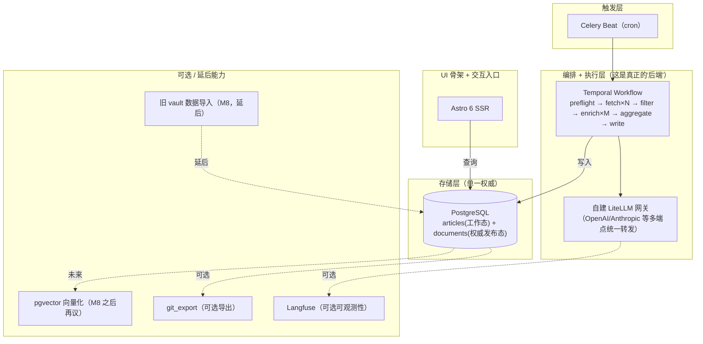
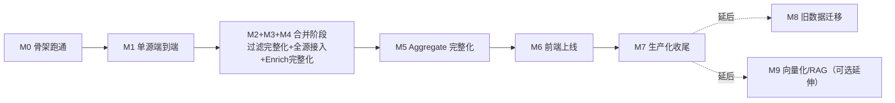

# ROADMAP：ainews-project 服务化系统开发路线图

> **本文档是新会话的唯一入口**。设计目标是让下一次开发会话完全在 `/Volumes/Projects/ainews-project` 内独立推进——**不需要**回读 `/Volumes/Projects/AInews`（旧 skill+agent 项目）的任何文件。旧系统里所有值得保留的业务规则，已经提炼进本文档 [§2 功能清单](#2-功能清单)；架构决策见同目录 [00-overview.md](./00-overview.md) / [01](./01-document-database-research.md) / [02](./02-pipeline-orchestration-research.md) / [03-architecture-proposal.md](./03-architecture-proposal.md)，这几份是同一批调研的产出，仍需一起读，但都在本仓库内，不涉及跨仓库耦合。

> **旧 vault 历史数据怎么办**：明确延后。见 [§4 里程碑 M8](#4-里程碑设计)——只有在 M0–M7 达成"生产化收尾"交付标准之后，才开始设计历史数据导入方案。前 8 个里程碑的推进不依赖、不等待这件事。

---

## 1. 系统架构图谱

完整架构细节（组件表、SQL schema、部署拓扑）见 [03-architecture-proposal.md](./03-architecture-proposal.md)。这里给一张面向"要建什么"的路线图版本：

**核心原则**（贯穿所有里程碑，忘了就回来看这段）：
- **Postgres 是唯一权威存储**，不是"从别处重建的索引"。`write_activity` 直接写，写完即发布。
- **内容更新 = 数据库写入，前端下一次请求立即可见**——不需要重新构建、不需要重新部署、不需要重启容器。这是长期运行服务的核心优势，每个里程碑的验收都应该能体现这一点。
- **per-article 子线程只判断"这篇文章本身是什么"**，跨文章判断（该归哪个 topic、是否与同批次其他文章重复）只能发生在 aggregate 阶段。
- 不引入任何厂商专属 Agent 框架；模型调用一律经自建 LiteLLM，用 tool schema 强制结构化输出。

---

## 2. 功能清单

以下规则从旧系统的 `filter-criteria.md` / `vault-schema.md` / `sources.md` / 8 个 subagent 定义提炼而来，已经按新架构的阶段重新组织。**这份清单本身就是规格**——实现时不需要再回读旧仓库。

### 2.1 信息源管理

- [ ] 源注册表数据结构（配置数据，非代码）：`name`（kebab-case 唯一） / `tier`（1/2/3） / `perspective`（research/product/investor） / `fetch_method`（rss/api/webfetch/script） / `script`（仅 script 方式填） / `reliability`（alive/degraded/dead） / `fallback`（bool，仅 tier 3） / `last_verified`（日期） / `bias`（可选，如 "VC"）
- [ ] Tier 分级逻辑：**Tier 1** 一手发布源+学术权威源（官方博客/论文 API）；**Tier 2** 聚合分析层（行业观察者周更/日更）；**Tier 3** 降级兜底源（无官方 RSS/API，或视角明显带偏向性）
- [ ] 初始种子信息源清单（14 个，作为配置数据迁移，不是业务逻辑）：

  | 层级 | 源 | perspective | fetch_method | 备注 |
  |---|---|---|---|---|
  | T1 | openai-rss | research | rss | 官方博客 |
  | T1 | deepmind-rss | research | rss | 官方博客 |
  | T1 | arxiv-api | research | api | 专用脚本封装限流（3秒/次），cs.AI/cs.LG |
  | T1 | huggingface-daily-papers | research | api | 社区点赞策展，信噪比最高 |
  | T2 | import-ai | research | rss | 政策/治理深度周评 |
  | T2 | interconnects | research | rss | 训练/RLHF 硬核评论，部分付费墙仅摘要 |
  | T2 | qbitai | product | rss | 中文高频源，需过滤融资/PR软文 |
  | T2 | air-street-press | investor | rss | 投资层里少见的干净结构化源 |
  | T3 | anthropic-news | research | webfetch | 无官方 RSS |
  | T3 | meta-ai-blog | research | webfetch | degraded，更新极慢 |
  | T3 | the-batch | research | webfetch | 吴恩达周评，质量高 |
  | T3 | jiqizhixin | product | script | 微信公众号镜像，需从 `content:encoded` 提取 mp 直链 |
  | T3 | a16z-news-content | investor + VC bias | script | 列表页缺日期，需详情页抓 `datePublished` |
  | T3 | state-of-ai | investor | webfetch | 年度报告锚点，平日基本无新条目 |

- [ ] 源健康检查：`last_verified` 超 30 天告警；连续失败先标 `degraded`（仍抓，过滤阶段降权），再连续失败才考虑 `dead`/拉黑

### 2.2 Fetch 阶段（`fetch_activity` × N，动态 fan-out）

- [ ] 四种抓取方式，统一输出 entry schema：`{title, url, published, raw_summary, low_confidence, extra}`
- [ ] **铁律：抓取阶段不做任何时间窗口过滤**——全量返回，交给 Filter 阶段统一处理（旧系统教训：抓取阶段自行过滤会与统一阈值冲突，误删 7-14 天内有效内容）
- [ ] `low_confidence` 判定条件（任一命中即标记）：标题/URL 歧义、摘要严重缺失、发布日期无法解析、URL 非文章直链、发布日期与抓取时间差异常
- [ ] RSS：直接提取条目列表
- [ ] API：需限流礼仪（如 arXiv 固定间隔）；需日期回退策略（今天无数据尝试昨天，再无返回空且不算错误）
- [ ] WebFetch：日期优先级规则——同时存在相对日期（"3天前"）和绝对日期时优先用相对日期换算；绝对日期做合理性校验（与当前时间差过大→低置信度）；相对路径 URL 需补全为绝对路径
- [ ] Script：抓取模块只负责调用脚本+解析标准化输出，脚本自带的诊断统计字段（如成功数/降级数）必须原样透传，不能丢弃（旧系统教训：丢弃这类字段导致过一次异常事后无法确诊）
- [ ] 错误处理：任何一种方式失败都要产出"空条目数组+错误原因"，不能完全不产出；0 条结果不算错误

### 2.3 Filter 阶段（`filter_activity`，批量、纯规则、必须在 fan-out 前完成）

- [ ] **执行顺序**：同批次去重 → 时效过滤（先于信噪过滤）→ 信噪过滤 → 跨日去重
- [ ] 同批次去重（4 级优先，命中即判重复，保留信息最完整一条）：① URL 完全相同 ② URL host+path 相同（忽略 query）③ 标题语义相似度 ≥0.85 ④ 摘要前 100 字重叠 ≥0.9
- [ ] 跨源同论文去重（范围限论文类源）：标题归一化后精确相等即合并，保留规范链接源版本，其余来源直接丢弃（`also_reported_by` 记账字段全链路无消费方，全量审查后已删除，见 `.claude/memory/decisions.md`）
- [ ] 不去重情形：中英双语同事件报道（两条都留，聚类阶段合并）；"通稿"与"深度分析"两种角度
- [ ] 时效过滤：单一阈值，发布日期距今 **>14 天** 一律丢弃（`stale:Nd_old`），不分来源等级
- [ ] 信噪比过滤：丢弃类别（融资PR/招聘/活动通知/广告/VC软文/营销软文/二手编译）+ 保留优先信号（arxiv.org/github.com/huggingface.co 域名、benchmark/SOTA、开源/论文关键词、政策类、安全对齐类）——保留信号覆盖所有丢弃规则
- [ ] 模糊地带兜底：判断不清 → 保留 + 标 `low_confidence=true`，交聚类阶段二判；不要在过滤阶段误删
- [ ] 跨日去重（30 天滚动窗口索引）：URL 归一化函数（小写、去 scheme、去 www、去 query/锚点、去尾斜杠）；命中索引 ≤7 天默认丢弃，除非 Jaccard 词汇重叠 ≤0.6（新角度豁免，标 `re_coverage=true`）；>7 天视为已淡出正常保留
- [ ] Jaccard 重叠计算：中文按字切分去停用词，英文按空格切分小写去停用词，`overlap=|A∩B|/|A∪B|`，任一方摘要为空则 overlap=0（不豁免）
- [ ] 索引维护：每条 URL 节点含 `first_seen_date/first_seen_run/title/source_name/kept_in_daily[]/zettel_id/raw_summary_excerpt`；`first_seen_date` 超 30 天读取时清理；仅 Filter（读写全部字段）和 Write（仅回填 `zettel_id`）能碰这个索引，其余阶段严禁写入
- [ ] 统计自检：`entries_after_dedup ≥ entries_after_filter ≥ 最终保留数`，各阶段丢弃计数之和应与总数对上——这是检测统计口径算错的机械校验

### 2.4 Enrich 阶段（`enrich_activity` × M，per-article 动态 fan-out，本次架构的核心重设计）

- [ ] **边界约束（反复强调）**：只判断"这篇文章本身是什么"，不判断"该归哪个 topic/是否与同批次其他文章重复"
- [ ] 原文抓取三态：① 主抓取成功→完整 HTML→Markdown 转换+翻译 ② 主抓取失败但备用抓取兜底成功→跳过转换只翻译，**此通道不下载图片**，图片保留原始外链 ③ 两者失败→进 Fallback
- [ ] Fallback A（优先）：通用网页抓取直接拿 Markdown 正文，跳过 HTML 转换仍需翻译，图片计 0，需记录降级说明
- [ ] Fallback B（A 也失败）：仅标题+原文链接+简短说明的占位正文，图片计 0，**仍必须完整写入这条记录**（保证下游双链引用不断链），需报告"全部抓取通道失败"
- [ ] 翻译逻辑：只要正文抓到且非中文就必须翻译，无例外（长文本用分段/分块策略，不允许因为长就放弃）；语言判断（元数据标注/标题中文字符/正文前 N 字符中日韩占比 >30%）；保留专有名词（首次出现原词+括号中文解释）、标题层级/代码块/公式/引用块结构、数字精确度；逐段对应，不合并不总结不评论
- [ ] **翻译完整性机械校验（硬约束）**：翻译完成后程序化检测非中文字符占比是否远低于预期（中文占比应明显 >50%，否则说明大段漏译）；检测正文是否残留未清理的 HTML/渲染标记；超长文本用"分块累积再一次性写入"而非"写不完就放弃"；唯一允许的降级路径是保留摘要/引言/结论完整翻译+占位说明未翻译部分，**不能悄悄标记为翻译完成**
- [ ] 配图抓取分级渲染：成功→本地相对路径；失败/跳过→占位块+"查看原图"外链（**不裸露原始长 URL**，避免撑破排版）；识别为视频占位图→"演示视频未归档"提示+外链；识别为 UI 图标噪声→完全跳过；无内容占位图→完全跳过
- [ ] 字数统计必须程序化机械计算，不能靠 LLM 自估（旧系统教训：估算偏差最高达 20-30 倍）
- [ ] 富元数据抽取（供 Aggregate 阶段消费）：实体/关键词、一段话摘要、内容类型分类、新颖度辅助信号（注意：这些都是"文章本身"层面的信号，不是最终 topic 归类结果）
- [ ] 独立 upsert 进 `articles` 表，独立重试——这是直接解决旧系统"originalizer 覆盖率不足靠人工补跑"痛点的核心机制

### 2.5 Aggregate 阶段（`aggregate_activity`，批量，唯一允许跨文章判断的地方）

> **2026-07-06 起，`aggregate_activity` 内部直接调用 write_activity 完成落库**，不再是 workflow 调度的两个独立 activity——真实批次（101 条记录，含全文正文）实测 `aggregate_activity` 的返回值序列化后达 4.3MB，超过 Temporal gRPC 消息上限（4MB），导致 activity 完成信号发不出去、从 workflow 角度看像是"一直不返回直到超时"。详见 §2.6 说明与 `.claude/memory/decisions.md`。

- [ ] Topic 聚类：预设主题桶（model-releases / safety-alignment / opensource-tools / research-papers / policy-regulation / industry-moves / funding-investment / infra-hardware / applications / agents），按"事件类型"分类，**不按来源/公司分类**
- [ ] 分桶粒度：桶内 <2 条归并入杂项；>8 条考虑拆分子类；新领域涌现 ≥3 条可创建新 topic
- [ ] **`is_new` 判定强制规则**：唯一依据是"该 slug 是否存在于当前实际的 topic 记录清单里"——不允许凭经验/推荐桶名称推断；下游 Write 阶段应以实际存储状态为最终依据，聚类误判要记录并纠正，不能将错就错
- [ ] Zettel 入选标准（三选一）：概念/方法首次出现（全库检索确认无对应笔记）；重大事件锚点（半年后回看仍重要）；可复用洞察（含"可被引用"的关键判断）
- [ ] Zettel 复用判断三级优先：① 跨日索引里该 URL 是否已有 zettel_id → 有则直接复用 ② 索引没有则按 slug 前缀搜索现有笔记库，命中则复用 ③ 都未命中才视为新概念创建
- [ ] 产出量软性指标：单次运行建议 3-10 张原子笔记，超过说明前置过滤不够严格；全部不达标是可接受的"低产日"
- [ ] Daily 写作结构：TL;DR（3-5条关键事件）+ 昨日回顾（若存在）+ 按主题分组（五种情形渲染：有笔记+有归档/无笔记有归档/有笔记归档缺失/复盘+旧笔记/复盘+未升级笔记）+ 本日数据统计
- [ ] Topic 写入铁律：首次创建写完整 frontmatter，**后续追加绝不整体重写**（会丢历史）；日期区块必须倒序（最新在前），需判断当天区块是否已存在再决定"区块内追加"还是"插入到最新区块之前"
- [ ] Digest 五项自检硬约束（违反视为输出失败）：① 禁止合成条目，每条必须对应唯一原始条目 ② 来源标识必须与注册表逐字一致，不可意译 ③ URL 字段必填且直接取自结构化数据源，不能从渲染文件反查 ④ 去重自检（同 URL/同标题不出现两次）⑤ 每条 2-3 句、硬性字符上限（原系统 120 字）
- [ ] Tags 打标策略：四轴分类（技术领域/产品公司/事件类型/来源质量标签），每条 2-5 个 tag，kebab-case 全小写，不发明新分类轴，不打宽泛无信息量标签
- [ ] Wikilink 格式：原子笔记用时间戳 ID、主题用 slug、日报用日期、原文归档用 ID（同文件名 stem）；**其余各层引用条目应优先双链到原文归档层**，只有归档失败（ID 为 null）才回退外链

### 2.6 Write 阶段（`write_activity`，直接 upsert 进 `documents` 表）

> **2026-07-06 起不再单独注册为 Temporal activity**，由 `aggregate_activity` 内部以普通函数调用方式触发（`write_activity` 函数本身保留在 `backend/worker/write.py`，签名/职责不变）。原因是 records（含全文正文）只应在 `aggregate_activity` 内部产生和消费，不应该经过 Temporal 的序列化/传输层跨 activity 边界传递一次——这正是 gRPC 4MB 消息上限被真实批次触发的路径。

- [ ] 五类文档 frontmatter 字段定义（Daily/Zettel/Topic/Digest/Original 各自字段表，含 `related_*` 系列字段模板默认空值、`fallback_notice` 三态语义：null=正常/字符串=降级原因/字段缺失=未启用）
- [ ] ID/slug 命名：原子笔记用 12 位分钟级时间戳（`YYYYMMDDHHmm-<slug>`）；原文归档与对应笔记**共用同一 HHMM**（便于精确配对反查）；同 HHMM 冲突顺延
- [ ] 跨日索引回填：写作完成后按 URL 精确字段级更新 `zettel_id`（新建则写入，复用旧笔记若索引未记录则补充），**不能整体覆盖索引**
- [ ] 落盘前自检：目录/命名/frontmatter 完整性/内部链接用 ID 而非标题/来源标识可查/首次创建 vs 追加判断清楚/图片归档统计如实/**字符串字段用标准序列化库处理转义**（旧系统教训：手写 YAML 拼接导致冒号/引号未转义反复引发下游全站构建失败，新系统直接用标准库从根本规避）

### 2.7 UI 骨架 + 交互入口（前端）

- [ ] Astro 6，`output: 'server'` + Node adapter，Live Content Collections 请求时查 Postgres
- [ ] 复用现有组件/布局/Tailwind 设计，五类内容页面渲染
- [ ] wikilink 渲染改为 DB 查询解析（不再是文件存在性检查）
- [ ] 页面级缓存（Node middleware 或 CDN + Cache-Control），避免每请求都打库

### 2.8 编排 / 模型执行 / 运维

- [x] Temporal workflow 定义：`preflight → fetch×N → filter → enrich×M(child workflow) → aggregate`（`aggregate_activity` 内部直接调用 `write_activity`，2026-07-06 起两者合并为一个 Temporal activity，详见 §2.6 说明）
- [x] 定时触发：Temporal 原生 Schedule（`worker.worker.ensure_pipeline_schedule`，worker 启动时幂等 ensure），每日 09:00 Asia/Shanghai，取代原计划的 Celery Beat 薄触发器——M7 落地时确认 Redis 在全代码库唯一用途就是 Celery broker，换成 Schedule 后 `celery-worker`/`celery-beat`/`redis` 三个容器整体退役，`backend/beat/` 模块删除，详见 `.claude/memory/decisions.md`
- [x] LiteLLM 网关接入，每个固定 LLM 场景定义 pydantic schema 做结构化输出。**经 Instructor 统一走 `Mode.JSON`**（`response_format=json_object` + prompt 注入 schema，完全不涉及 `tool_choice`）——M0 用真实网关对裸 `openai` SDK 实测过强制 tool_choice（`{"type":"function","function":{"name":...}}` / `required`），发现是否支持因模型而异（DeepSeek v4 系列在这台网关的任何调用路径下都不支持，Qwen 系列需要额外传 `extra_body={"enable_thinking": False}` 才支持）；M1 进一步实测发现经 Instructor 调用时连"退而求其次用 `tool_choice=auto`"这条路都不成立——Instructor 的 `Mode.TOOLS` 会忽略显式传入的 `tool_choice`，自己强制指向该 function，`deepseek-v4-flash` 依然报同一个错误。最终修正为 `Mode.JSON`，完全不依赖 function-calling 能力，也不需要再关心某个模型是否支持强制/auto 的 tool_choice，正确性交给 Instructor 的 pydantic 校验 + Temporal 重试兜底。详见 `.claude/memory/decisions.md`「经 Instructor 时统一用 Mode.JSON，不是 tool_choice=auto（M1 修正）」。已验证支持强制模式的模型清单见 `backend/config/models.yaml` 的 `tool_choice_forced` 字段（纯历史参考存档，不是本项目的调用策略依据）。
- [ ] Instructor 重试次数设到最低（1 或 0），失败直接抛异常交给 Temporal activity 重试策略统一处理，避免嵌套重试
- [ ] Postgres 备份策略（`pg_dump` 定期快照，是否需要 WAL 归档做 PITR 待定，见 03 §7 问题 7）
- [ ] （可选）Langfuse 接入，经 LiteLLM callback
- [ ] （可选）`git_export` 独立任务
- [ ] （延后）pgvector 向量化

---

## 3. 推进顺序

不做大爆炸式重写，按依赖关系从下往上、从窄到宽推进：

M1 独立验收，前一个不达标不进入下一个；**M2-M4 从路线图调整为合并成一个连续推进阶段**（不再逐个里程碑停下确认），理由与调整记录见 `.claude/memory/decisions.md`「M1 单独验收，M2-M4 合并成一个连续阶段推进」——M1 用单一源验证的是"新架构管道形状对不对"，这是探索性工作，值得用最小代价提前暴露问题（M1 实测就先撞上了 openai.com 的 Cloudflare 反爬挑战，验证了这个价值）；M2-M4 的规则本身是从老系统迁移已经过实测验证的内容，不确定性低，合并推进更高效。M5 之后仍按原节奏，独立验收；允许小范围并行（比如 M6 前端改造可以在 M4/M5 收尾阶段就先动手，因为它依赖的是 `documents` 表 schema 而非 Enrich/Aggregate 的完整业务规则）。

## 4. 里程碑设计

### M0 — 项目骨架跑通
**范围**：仓库结构初始化；Postgres schema 落地（`articles`/`documents`/`links`/`tags`，见 03 §3）；Temporal Server + Worker 能跑一个 hello-world workflow；Celery Beat 能触发一次 `start_workflow`；LiteLLM 网关连通性测试（跑通一次强制 tool_choice 的结构化调用）。
**不做**：任何实际抓取/过滤/聚类业务逻辑。
**验收标准**：手动触发一次空 workflow，Temporal Web UI 能看到完整执行历史；Postgres 里能查到一条测试写入记录。

### M1 — 单源端到端最小管道
**范围**：选 1 个最简单源（建议 `openai-rss`，纯 RSS 无特殊兜底需求）。实现最简版 `preflight_activity`（源健康检查）+ `fetch_activity`（仅 rss 方式）+ `filter_activity`（先只做同批次去重 + 14 天时效过滤，跨日去重/信噪过滤放 M2）+ `enrich_activity`（单条：抓原文 + 翻译判断，元数据抽取先做最简版）+ `aggregate_activity`（最简单版本，不做 is_new 判断，先固定当已有 topic 处理）+ `write_activity`（写入 `documents`，先只支持 zettel 类型）。
**验收标准**：定时或手动触发一次，从这 1 个真实 RSS 源抓到内容，走完整链路，`documents` 表里能查到结构完整的 zettel 记录。

### M2 — 过滤/去重规则完整化
**范围**：完整实现 [§2.3](#23-filter-阶段filter_activity批量纯规则必须在-fan-out-前完成) 全部规则——信噪比过滤表、跨日去重 30 天索引、Jaccard 相似度豁免、跨源论文去重。
**验收标准**：统计自检（单调递减关系）跑通；能验证"复盘"条目正确复用旧 `zettel_id` 而不是重复创建。

### M3 — 全信息源接入
**范围**：接入剩余 13 个源，实现四种 `fetch_method`（api 含限流礼仪与日期回退；webfetch 含相对日期优先级；script 含诊断 stats 透传）。
**验收标准**：一次跑能处理全部 14 源；`reliability` 状态机（alive/degraded/dead）正常工作。

### M4 — Enrich 阶段完整化（原文归档能力）
**范围**：完整实现 [§2.4](#24-enrich-阶段enrich_activity--m per-article-动态-fan-out本次架构的核心重设计) 三态处理 + Fallback A/B + 翻译完整性机械校验 + 配图分级渲染。
**验收标准**：**故意构造一批超预期规模的批次（如 50+ 条）**，验证 Temporal 的持久化重试确实不再出现"部分放弃、覆盖率不足"的情况——这是对照旧系统 2026-07-04 那次 28% 覆盖率故障的核心验证点，originalize 覆盖率应达到 100%（Fallback B 占位也算完成，不算失败）。

### M5 — Aggregate 阶段完整化（聚类 + 写作规则）
**范围**：完整实现 [§2.5](#25-aggregate-阶段aggregate_activity批量唯一允许跨文章判断的地方) 全部规则——topic 聚类桶与粒度规则、`is_new` 强制规则、zettel 复用三级判断、Daily 五种情形渲染、Topic 追加铁律、Digest 五项自检、tags 四轴策略。
**验收标准**：人工抽查一次完整跑的产出，逐项对照 §2.5 checklist 全部通过。

### M6 — 前端上线
**范围**：Astro 6 SSR 改造，复用现有组件设计，五类页面接入 Postgres 查询。
**验收标准**：浏览器访问可见 M1-M5 产出的真实内容；**验证"无需重建"这一核心卖点**——手动往 `documents` 表插一条测试记录，刷新页面立即可见，全程不碰 Astro 容器（不重新构建、不重启）。

### M7 — 生产化收尾
**范围**：Postgres 备份策略落地；定时触发对接真实定时任务（替代旧系统对 Desktop Scheduled Task + "保持电脑唤醒"的依赖）；按需决定是否接入 Langfuse / `git_export`。
**落地**：定时触发实际改用 Temporal 原生 Schedule（不是立项时计划的 Celery Beat），核实 Redis 全代码库唯一用途就是 Celery broker 后，`celery-worker`/`celery-beat`/`redis` 三个容器整体退役，详见 §2.8 与 `.claude/memory/decisions.md`。
**验收标准**：新系统能独立连续运行至少 7 天不需要人工干预（2026-07-05 起观察期，开发工作已完成）；此时可以考虑退役旧 AInews 的 Desktop Scheduled Task。

### M8 — 历史数据迁移
**已完成（2026-07-05，提前于原定"M7 验收后"执行，用户两次明确要求提前）**：把旧 AInews vault（341 个内容文档，`50-Zettel`/`20-Topics`/`10-Daily`/`30-Digests`/`60-Originals`）里新系统没有覆盖到的历史内容导入 Postgres，正式写入 272 条文档。核实新旧系统时间窗口存在真实重叠（不是简单接续），策略是 Original/Zettel/Topic/Digest 冲突时新系统数据为准，只补新系统没有的内容；**Daily 例外**——旧系统按天拆分的粒度按用户要求保留补齐。执行前手动 `pg_dump` 快照作为安全网，执行后前端页面抽查全部正常渲染。详见 [`docs/milestones/M8-legacy-migration.md`](./milestones/M8-legacy-migration.md)。

### M9 — 向量化 / RAG 扩展（可选延伸，同样延后）
见 [03-architecture-proposal.md §8](./03-architecture-proposal.md#8-未来扩展向量化--自建-rag)。不新增数据库，复用同一 Postgres 实例的 `pgvector` 扩展；embedding 模型选型待独立调研。

### M10 — Deep Dive：跨天聚合深度解读（已完成，旧系统从未实现）
**背景**：旧系统设计过"Deep Dive"（`40-Deep-Dives/`）——对 Digest 层做跨天/跨周二次聚合，识别跨日延续主题/热门 topic 趋势线。**核实这个功能在旧系统里从未真正实现过**（目录自建库以来只有空 `.gitkeep`，无对应 agent，前端是"筹备中"空态），不是"已验证规则待迁移"，是净新设计。
**触发条件（已达成）**：新系统 `documents` 表 `doc_type='digest'` 积累足够天数历史（沿用旧系统"≥7 天"门槛作参考起点）。2026-07-09 核查已有 12 天连续历史，正式启动实现。
**实现**：独立 Temporal Schedule（每周一 09:00 Asia/Shanghai），机械统计"热门 topic"趋势（不重新聚类，复用既有 topic_slug）+ 1 次 LLM 调用生成周叙事导语，新增独立 `doc_type='deep_dive'`，完全只读输入 + 单条新增输出，不改写任何既有文档。详见 [`docs/milestones/M10-deep-dive.md`](./milestones/M10-deep-dive.md)。

### M11 — Topic Deep Dive：专题月报（净新设计，M10 的正交扩展）
**背景**：M10 周报是"全部 10 个 topic 桶 × 7 天窗口"的横向广度扫描；用户提出希望增加"固定 1 个 topic 桶 × 自然月窗口"的纵向深度扫描，结合 topic 分桶 + zettel 原子笔记 + 深挖 original 全文，产出如"模型发布专题月报""应用案例专题月报"这类更聚焦的深度内容。两者共享同一套设计哲学（机械统计决定"选什么"，LLM 只负责"怎么讲"），互不依赖、互为正交维度。
**触发条件**：不额外设数据量门槛（M10 周报同一批数据已充分验证过链路），2026-07-09 走完完整设计确认流程（对话式设计提案 + 3 处关键决策点用户显式选择）后直接启动。
**实现**：新增独立 Temporal Schedule（每月 1 号 09:00 Asia/Shanghai，回看上一个完整自然月），先机械统计上月各 topic 桶 `total_count`/`active_days` 双门槛（`>=8` 且 `>=4`）筛出达标桶，按达标 topic 做 child workflow fan-out（仿 `EnrichArticleWorkflow` 的 per-unit fan-out 模式，某桶生成失败不影响其余桶）；每个 child 内部两段 activity（仿 `DeepDiveWorkflow` 结构）：先只返回统计数字的 stats activity，再在同一个 activity 内重新查询该 topic 本月全部 zettel（骨架素材，超过 30 条机械截断取最新 30 条）+ 反查最多 10 篇 original 全文（深挖细节，按 doc_date 降序取最新 10 篇）+ 全量数量/日期分布（热度背景）、调 1 次结构化 LLM（新增 `TopicDeepDiveNarrative` schema：导语 + 2-4 个子叙事小节）、组装、落库（避免含全文素材跨 activity 边界传递，重演 gRPC 4MB 教训）。复用既有 `doc_type='deep_dive'`，**用 `topic_slug` 字段有无天然区分月报/周报**（不新增 `scope` 字段，周报历史记录零改动），前端 `doc-type.ts`/`LuminaBacklinks.astro` 因此零改动，只需列表页/详情页做条件渲染适配两种形态。详见 [`docs/milestones/M11-topic-deep-dive.md`](./milestones/M11-topic-deep-dive.md)。

---

## 5. 待决问题索引

具体的架构级待决问题（Temporal 部署形态、Postgres 备份节奏、git_export 启用与否等）已经在 [03-architecture-proposal.md §7](./03-architecture-proposal.md#7-待决问题) 详细列出，此处不重复。新会话开始 M0 之前，建议先过一遍那份清单，能提前定的尽量提前定，减少推进中的返工。
