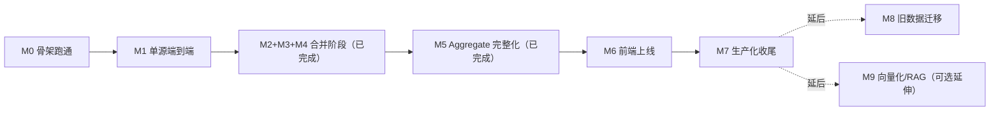

# 里程碑文档索引

> 本目录下每份文件是 [`../04-roadmap.md`](../04-roadmap.md) §4 中对应里程碑的**执行细化版**：把 roadmap 里的一段范围描述，展开成可勾选的任务 checklist + 明确的验收标准。**04 是规则来源，本目录是任务分解**——两者配合读，不要脱离 04 单独理解某个里程碑文件里的规则细节（规则的完整上下文、旧系统教训、边界约束的"为什么"都在 04 §2 功能清单里）。

## 推进顺序

M1 独立验收；**M2-M4 从"逐个里程碑独立验收"调整为合并成一个连续推进阶段**（调整理由见 `.claude/memory/decisions.md`「M1 单独验收，M2-M4 合并成一个连续阶段推进」与 `04-roadmap.md` §3），已完成。M5 起恢复独立验收；允许小范围并行——M6 前端改造可以在 M4/M5 收尾阶段就先动手，因为它依赖的是 `documents` 表 schema 而非 Enrich/Aggregate 的完整业务规则。

## 文件列表

| 里程碑 | 文件 | 一句话目标 | 状态 |
|---|---|---|---|
| M0 | [M0-skeleton.md](./M0-skeleton.md) | 项目骨架跑通：Postgres/Temporal/Celery/LiteLLM 四件套连通 | 已完成 |
| M1 | [M1-single-source-e2e.md](./M1-single-source-e2e.md) | 单源（openai-rss）端到端最小管道跑通 | 已完成（2026-07-04） |
| M2 | [M2-filter-dedup.md](./M2-filter-dedup.md) | 过滤/去重规则完整化 | **已完成**（2026-07-04，M2+M3+M4 合并阶段） |
| M3 | [M3-all-sources.md](./M3-all-sources.md) | 全部 14 个信息源接入 | **已完成**（2026-07-04，M2+M3+M4 合并阶段） |
| M4 | [M4-enrich.md](./M4-enrich.md) | Enrich 阶段完整化（原文归档能力） | **已完成**（2026-07-04，M2+M3+M4 合并阶段） |
| M5 | [M5-aggregate.md](./M5-aggregate.md) | Aggregate 阶段完整化（聚类 + 写作规则） | **已完成**（2026-07-05） |
| M6 | [M6-frontend.md](./M6-frontend.md) | 前端上线（Astro SSR 接入 Postgres） | 未开始 |
| M7 | [M7-production-hardening.md](./M7-production-hardening.md) | 生产化收尾，可独立连续运行 | 未开始 |
| M8 | [M8-legacy-migration.md](./M8-legacy-migration.md) | 旧 vault 历史数据迁移（明确延后） | 延后 |
| M9 | [M9-vectorization.md](./M9-vectorization.md) | 向量化 / RAG 扩展（可选延伸） | 延后 |

## 使用说明（给新会话）

1. 先确认当前推进到哪个里程碑（看上表"状态"列，或直接问用户）。
2. 开始某个里程碑前，先读 04 §1 核心原则 + 04 §2 中该里程碑覆盖的功能清单小节，再读本目录对应文件的任务 checklist。
3. 逐项推进，完成一项在对应文件里把 `- [ ]` 改成 `- [x]`；全部完成后对照"验收标准"逐条核实，全部通过才把上表"状态"改成"已完成"并进入下一个里程碑。
4. 不要跳过 04 直接凭本文件推断业务规则细节——本文件的 checklist 是从 04 提炼的执行清单，不是替代品；遇到 checklist 里没覆盖到的边界情况，回 04 §2 找权威表述。
